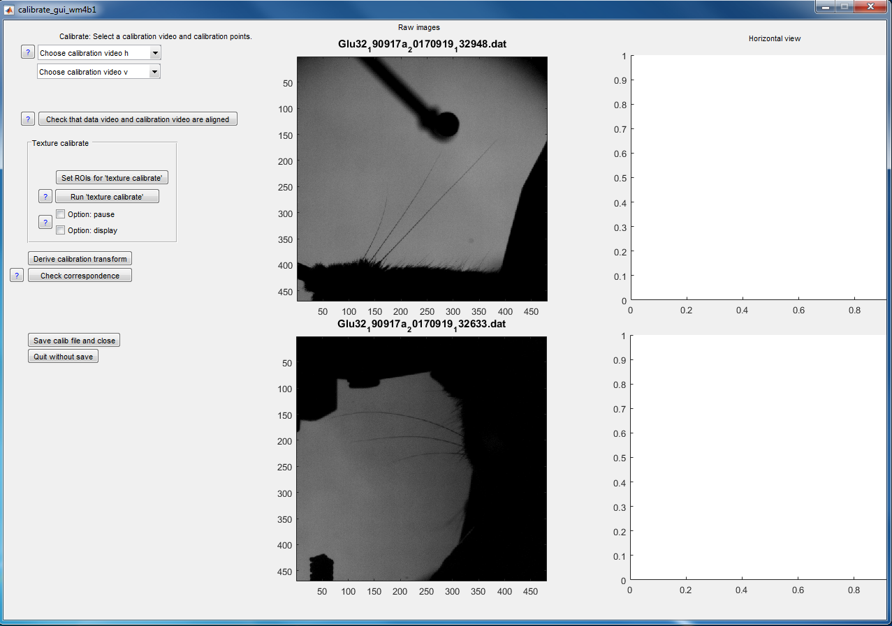
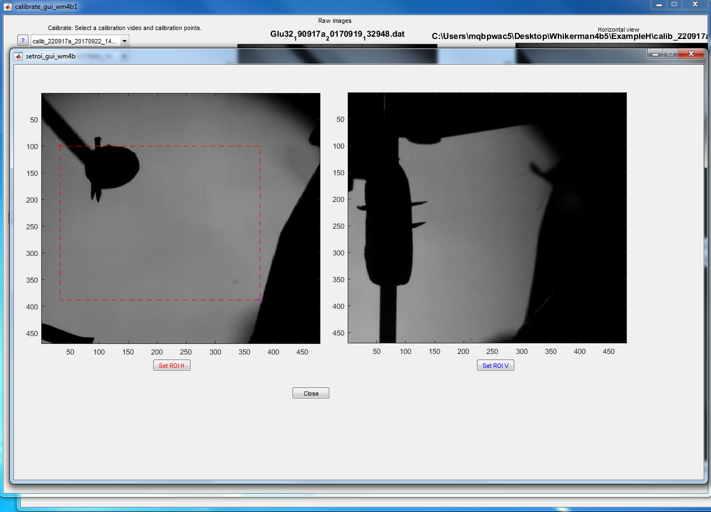
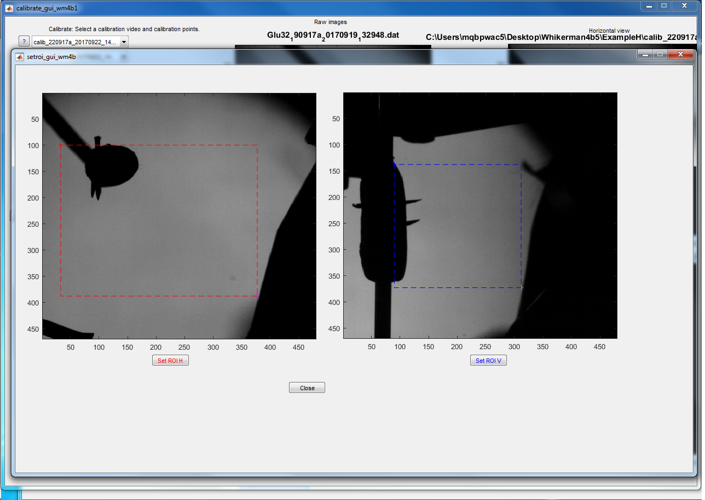
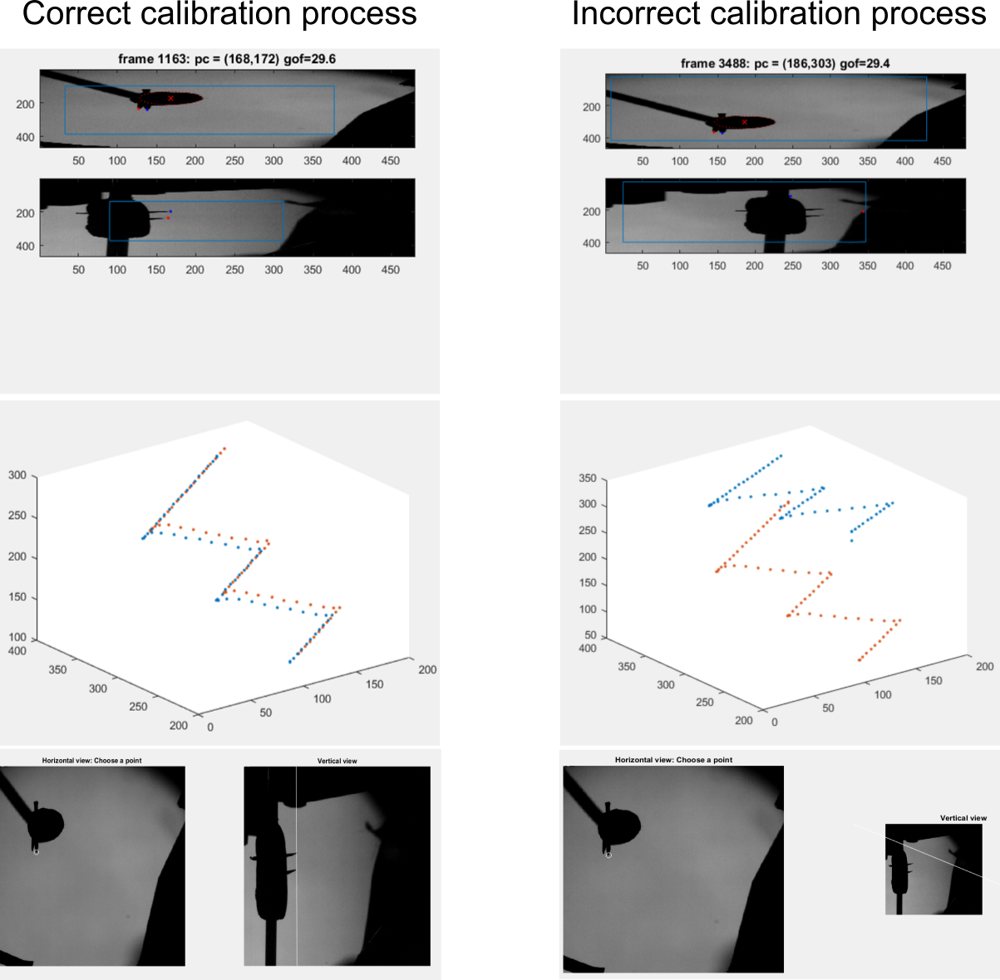

# Whi[s]kerMan Documentation

## Table of contents
- [Open Whiskerman](./Open_whiskerman.md#open-whiskerman)

- [2D Whisker Tracking](./Open_whiskerman.md#2d-whisker-tracking)
  
  - [Single whisker](./Open_whiskerman.md#tracking-one-whisker)
  
  - [Multiple whiskers](./Open_whiskerman.md#tracking-multiple-whiskers)
  
 - [3D Whisker Tracking](./Open_whiskerman.md#3d-whisker-tracking)
 
 - [3D Calibration](./Open_whiskerman.md#3d-calibration)
 
 - [Others](./Open_whiskerman.md#Others)
 
 - [Buttons and options in the GUI](./Open_whiskerman.md#buttons-and-options-in-the-gui)
 
 - [Keyboard commands](./Open_whiskerman.md#keyboard-commands)

## Open WhiskerMan 

1. Extract Whiskerman  to a folder (e.g. "C:\user\whiskerman ").

2. Within Matlab, add this folder to the current path (e.g addpath(‘C:\ user\whiskerman’)).

3. Make a  folder that contains the horizontal view videos (e.g. cd ‘C:\ExampleH’). If doing 3D tracking also, within this folder, create a sub-folder called “vertical_view” (the name must be exactly this) containing the vertical view videos.

4. Within Matlab, “cd” to the folder containing the horizontal view videos and enter ‘WhiskerMan’ on the command line.  A GUI resembling the following should appear.

## 2D Whisker Tracking

### Tracking one whisker:
---

1. In the Whiskerman gui … Select “2D tracking”

2. Select the video to be tracked using the “Choose H video” menu.

3. Select “Continuous tracking” (otherwise only the current frame is tracked)

4. Press “Track whiskers” to start the tracking of the first frame. 

5. Whiskerman will prompt you to initialise the control points of the whiskers highlighting the position of the cursor (see the paper for explanation). 
To define the control points, select, using mouse clicks, the first, second and third control point of the Bezier curve in the horizontal view (starting with that closest to the snout).
If parameters are set appropriately for your video, Whiskerman will track each frame until either the end of the video is reached or the algorithm’s quality control criteria fail in a given frame.

6. To halt tracking at any point, deselect “Continuous tracking”.

**Common problem:** 

If Whiskerman tracks the first frame but then stops, a common reason for this is that the parameter “current whisker energy threshold” is too low.  See the paper for explanation of how Whiskerman evaluates the quality of its tracking solutions (using a cost function) and see the hints below for something to try that often works.

### Tracking multiple whiskers:
---

1. In the whiskerman gui … Select “2D tracking”

2. Select the video to be tracked using the “Choose H video” menu.

3. Define the whiskers to be tracked in the “identification of the whiskers” section. To do this, write the name of the first whisker and define the energy threshold for the whisker. 

4. To add another whisker, press “add whisker” and complete the information of the following whisker.

5. Press “Track whiskers” to start the tracking of the first frame. Whiskerman will prompt the user to initialise the control points of the whiskers highlighting the position of the cursor. To define the control points, select, using mouse clicks, the first, second and third control point of the Bezier curve in the horizontal view (starting with that closest to the snout). If more than one whisker were defined, follow the same procedure for the next whiskers.
Whiskerman will show the tracking of the first frame and will move to the next frame. To track the current frame, press “Track whiskers”. Alternatively, select “Continuous tracking” and then press “Track whiskers”, in which case the tracking proceeds automatically from frame to frame until: a) “Continuous tracking” is deselected, b) the end of the video is reached or c) tracking fails for all selected whiskers.

**Hints:**

- If the tracker halts after tracking just one frame, it may be that the “current whisker energy threshold” parameter is too low.  
Whiskerman evaluates the quality of its solution for a given frame by computing an “energy” value (see the paper for detailed explanation).  

- If this energy is less than threshold, tracking stops.  The radio button “whisker selected” will be deselected.  
To restart tracking, increase the value of the threshold, (re)select “whisker selected”, and then click “Track whiskers”. 

## 3D Whisker Tracking

**Requirements:**

1. One or more pairs of videos, with each pair consisting of a horizontal view of the mouse and a vertical view

2. Calibration videos

### Instructions

1. Select “3D tracking”

2. Using the “Choose H video” menu, select the horizontal view video you wish to be track.

3. Using the “Choose V video” menu, select the corresponding vertical view video. The first frame of each video should appear in the display. 

3. Calibrate.  If videos with the current camera configuration have previously been tracked, calibration data will have been saved in the corresponding .tr4 file and can be loaded using the ‘Set calibration from .tr4’ menu.  Otherwise, use calibration videos, as detailed below.

4. In the “identification of the whiskers” section of the GUI, define the whiskers to be tracked. To do this, for the first whisker that you want to track, specify its “current whisker label” (C1, C2 etc) and, if desired, the energy threshold (see help). To track an additional whisker, press “add whisker” and complete the information of the following whisker.  Repeat for as many whiskers as desired.

5. To initiate tracking, press the “Track whiskers”  button.  Note that this button is disabled until calibration information is specified. 

6. If this is the first frame of an untracked video, a cross-hair will appear, prompting you to initialise NBezier control points for the selected whiskers. Start by defining control points for the first whisker in the horizontal view (See figure below).  Use the mouse to position the cross-hairs at each control point in turn (starting with that closest to the snout) and select using mouse clicks. Next, a guide line will appear in the vertical view that specifies the locus of points in this view consistent with the point selected in the horizontal view.  Define control points in the vertical view by using the mouse to move the cross-hairs to the desired location along the guide line and left-click.  Repeat for the other two control points.  If more than one whisker was defined, follow the same procedure for each in turn.  WhiskerMan will then use the specified points as initial conditions to fit Bezier curves to the whiskers in the current frame.  If the fitting is successful, WhiskerMan will then advance to the next frame. 

7. To check the solution, use the left arrow on the keyboard to step back to the previous frame.  The tracking solutions are shown as coloured curves and the control points as dots (See figure Below).  If tracking has succeeded, these curves will match the shape of the target whiskers.  If not, try re-initialising or vary tracking parameters (see help).

8. Step to the first untracked frame and, press “Track Whiskers”.  Alternatively, first select “Continuous tracking” in which case the tracking proceeds automatically until : a) “Continuous tracking” is deselected, b) the end of the video is reached or c) tracking fails for all selected whiskers.

## 3D Calibration

1. To calibrate a video, open whikerman, select the horizontal and the vertical videos and press “Calibrate”. This will open the calibration GUI (see figure below).

2. Select the horizontal and vertical view of the calibration videos from the “Choose calibration video h” and “Choose calibration video v” menus respectively.

3. Press “Set ROIs for texture calibrate” to select the ROIs. This will open a new window on the screen (see figure below).

4. To select the ROI of the horizontal view, press “Set ROI H”. The GUI will highlight the cursor position. Select the up left corner of the ROI and then select the down right corner. The selected ROI will be highlighted in red (see figure above).

5. To select the ROI of the vertical view, press “Set ROI V”. The GUI will highlight the cursor position. Select the up left corner of the ROI and then select the down right corner. The selected ROI will be highlighted in blue (see figure below). Press “Close”.

6. The ROIs must cover the regions where the pointy ends are during the whole video, but avoid sections in which other elements in the frame can be considered as pointy ends.

7. Select the “display” option and press “Run ‘texture calibrate’”. This will open a new figure showing the two views of the calibration video with the ROIs superimposed. In addition, the figure will display the identification of the algorithm for the pointy ends (a red dot and a blue dot) and the position of the pole in the horizontal view. The red and blue dot should match the pointy end positions at all times, if not, the ROIs should be selected again and press “Run ‘texture calibrate’”. An example for a correct and an incorrect calibration process are shown below.

8. At the end of the video, a new figure will be displayed showing the trajectories of the pointy ends in 3D. If the trajectory does not match the real position of the pointy ends, the calibration process should start again, selecting new ROIs.

9. If the trajectories match the pointy ends position, press “Derive calibration transform”.

10. To check the calibration process, press “Check correspondence”. A new figure will be displayed showing a frame of the calibration videos. The user will be prompted to select one point in the horizontal view (e.g one of the pointy ends) and will show the correspondent position in the vertical view. If the correspondence is correct press “save calib file and close”, otherwise go back to step 3.
 
## Others

- To edit manually the tracking for a given frame: Select the whisker that will be edited using the key “w”, press the “up arrow”  or the “down arrow” key to select the control point to be edited. 

- Move the selected control point using “Alt” + the arrow keys, PgUp or PgDn. Details can be found on section “Keyboard commands”.

- To navigate through the video: Use the right (forward) and left (backward) keys in addition to the modifiers “Shift” (move 10 frames) and “Ctrl” (move 100 frames).  E.g. “Ctrl+right arrow” will show advance 100 frames forward.

- Press “Plot Angles and Curvatures” to see the kinematic variables for the tracked frames: Azimuth angle, Elevation angle, Horizontal curvature and Vertical curvature.

## Buttons and options in the GUI
 
### Selection of the type of tracking 

1.	**2D tracking**: Prepare the GUI to track only using the horizontal view
2.	**3D tracking**: Prepare the GUI to track using the horizontal and vertical view 

### Selection of videos and calibration 

1.	**Choose H video**: Menu that contains all the .dat files in the folder corresponding to the horizontal view
2.	**Choose V video**: Menu that contains all the .dat files in the folder corresponding to the vertical view
3.	**Initialisation file**: Menu that contains all the .tr4 files in the folder corresponding to the horizontal view. Selecting a .tr4 file from this menu will produce samples of the Bezier curves for all the whiskers saved in the .tr4 file. The curves will appear on the screen when the button “Track Whiskers” is pressed for the first time. (optional)
4.	**Calibrate**: Open the GUI to calibrate the horizontal and vertical view
5.	**Set calibration from .tr4**: Menu that contains all the .tr4 files in the folder corresponding to the horizontal view. Alternatively to “Calibrate”, selecting a .tr4 file from this menu will import the information that was used to calibrate the corresponding video and calibrate the current video using the same information (matrix and vector).

### Identification of whiskers to be tracked

1.	**Number whiskers**: Shows the number of whiskers currently defined
2.	**Current whisker index**: Shows the number of the whisker that is currently being edited
3.	**Current whisker label**: Shows the label (eg “C2”) of the whisker that is currently being edited. This label can be edited from the default name “xx” to the name of the whisker.
4.	**Current whisker energy threshold**: Shows the energy threshold for the current whisker. This number can be edited from the default value 180 to higher (useful for short/light whiskers) or lower (useful for long/dark whiskers) values. If the energy of the fit to the current whisker is higher than the threshold, the whisker will be deselected and will not be tracked in the subsequent frames.
5.	**Whisker selected**: This option indicates if the current whisker is selected for tracking. Pressing this button will select/deselect the current whisker. If the whisker is not selected, the whisker will not be tracked or showed in the following frames, but will conserve the information saved so far. 
6.	**Select all whiskers**: Pressing this button will select all the whiskers currently defined for tracking.
7.	**Add whisker**: Pressing this button will add a new whisker and will complete the fields “Current whisker label” and “Current whisker energy threshold” with the default values.
8.	**Reset current whisker**: Pressing this button will delete tracking data for the current whisker (information in the fields “Current whisker label” and “Current whisker energy threshold” is preserved).
9.	**Delete current whisker**: Pressing this button will delete all tracking data and information related to the current whisker.

 ### Tracking parameters

1.	**Plot contour**: Pressing this button will display the snout contour in both views for tracked frames. (optional)
2.	**Frame interval**: Tracking data are displayed every “frame interval” frames. The default “1” is to show every frame but if this slows down processing, it can be useful to use a higher value.  Note that this parameter affects only display – all frames are always tracked.
3.	**Snout sigma**: Snout contour smoothness parameter. Higher values result in smoother contours. Default “12”
4.	**Sigma1 prior**: Whisker contour temporal smoothness parameter. Higher values result in smoother time series of the whisker angles and curvatures.
5.	**Sigma2 prior**: Whisker contour shape parameter.  Shows the current value for the factor of the distance between the middle control point and the two end control points. Higher values of Sigma_2 result in the middle Bezier control point of each whisker contour being closer to the half-way point along the whisker contour.  This is important for regularising the solution for the middle control point when the whisker contour is near straight.
6.	**Tracking direction**: Shows the current tracking direction ( “fwd” or “bkwd”). 
7.	**Snout outliers**: Shows the number of points that will be cut from the ends of the snout of contour.  (Note: this is useful when the water port is clearly visible in the horizontal view or both sides of the snout contour are visible)
8.	**Replicate last frame**: Replicate the Bezier curve from the previous frame for the selected whiskers. (Note: this option is useful when sudden  and short moves happens, e.g. slips-sticks) 

 ### Output/ check tracking and video

1.	**Plot Angles and Curvatures**: Plot results for the four basic variables, that characterise the location and shape of the base of the whisker contours: Azimuth angle, Elevation angle, Horizontal curvature and Vertical curvature
2.	**Export Angles and Curvatures**: Save the results for the four basic variables as a .mat file named as “Kinematics_horizontal_video_name.mat”. In this file, the variables (Azimuth, Horizontal_curvature, Vertical_curvature and Elevation) have the size [frames, number of whiskers]. Frames that are not tracked present all variables equal to zero. 

#### Video playback
This section allows playing the video with the Bezier curves of all the tracked whiskers overlapped.

3.	**Start**: Play the video starting from the current frame
4.	**Stop**: Stop the video
5.	**Reverse/forward**: Control the direction in which the video is played (“forward” (default) or “reverse”).
6.	**Inter-frame pause**: During video playback, pause between frames of the video (in seconds). Default is “0.1 s”.
7.	**Frame interval**: During video playback, display one out of every ‘frame interval’ frames.  Default is “1” (show every frame).
8.	**Go to start**: Go to first frame of the video (in both horizontal and vertical views). 

 
### Track current video

1.	**Track Whiskers**: If all the selected whiskers were tracked in the previous frame, pressing “Track Whiskers” will fit Bezier curves to the selected whiskers in the current frame and will then show the next frame to be tracked. If any of the whiskers were not tracked in the previous frame, pressing “Track Whiskers” will prompt the user to initialise those whiskers.  To initialise the whiskers, select, using mouse clicks, the first, second and third control point of the Bezier curve in the horizontal view (starting with that closest to the snout). Then, select (in the same order) control points in the vertical view, following the guides showed on the screen.

2.	**Continuous tracking**: If this option is selected and then “Track Whiskers” is pressed, tracking proceeds automatically from frame to frame until: a) “Continuous tracking” is deselected, b) the end of the video is reached or c) tracking fails for all selected whiskers.

### Track batches of videos

This section allows tracking multiple videos consecutively. To use this section at least one .tr4 file with the whiskers tracked must be available. 

**Considerations:**

the .tr4 used as init file act as a template for the shape and position of the whisker. Then, ideally the whisker(s) tracked in the init file should be representative of both, the shape and the position of the whiskers. 

1. Chose between between 2d and 3d tracking. 

2.	Choose init file: Menu that contains all .tr4 files in the folder corresponding to the horizontal view. Selecting a .tr4 file loads samples of the Bezier curves for all whiskers from that file.  WhiskerMan will then attempt to initialise the whiskers in the current video using those data, without manual initialisation.
  
 3.	Choose batch file: Menu that contains all the .bat files in the folder corresponding to the horizontal view.  A .bat (batch) file is a text file containing a list of .dat files (horizontal and vertical videos) to be tracked (one per line).
  
 4.	Start batch file: Start tracking the videos in the selected .bat file batch. If tracking fails at some point for a given video, tracking data for that video will saved in the corresponding .tr4 file and tracking of the next video in the .bat file will commence.
  
5.	If a valid batch and init files were selected, whiskerman will attempt to autoinitialise the video. 

6.	For each whisker a message will appear showing the energy of the best solution found and a “…good” message indicating if the energy of the best solution is lower than 1.1 threshold of the init file and the whisker will be tracked. Otherwise, the message “…bad” will appear.

7.	After completing the tracking of the video, whiskerman will automatically continue with the next video on the batch file. 

 
## Keyboard commands 

### Navigation though the video

1. **Right arrow**= advance 1 frame forward
2. **Shift+ Right arrow**= advance 10 frames forward
3. **Ctrl+ Right arrow**= advance 100 frames forward
4. **Left arrow**= advance 1 frame backward
5. **Shift+ Left arrow**= advance 10 frames forward
6. **Ctrl+ Left arrow**= advance 100 frames backward

### Manual editing of Bezier control points
 
1.	**w**= change current whisker. This will display the number of the current frame, the energy value and the length of the Bezier curve for the current whisker at the top of the GUI.
2.	**Down arrow**= start manual editing mode for current whisker (selected with w)
3.	**Up arrow**= start manual editing mode for current whisker (selected with w)

Once in the manual editing mode:

4.	**Down arrow**= Change the currently selected control point
5.	**Up arrow**= Change the currently selected control point

Once the control point is selected:

6.	**Alt+ left arrow**= move the selected control point in the negative x direction (x axis of the horizontal view)
7.	**Alt+ right arrow**= move the selected control point in the positive x direction
8.	**Alt+ up arrow**= move the selected control point in the positive y direction (y axis of the horizontal view)
9.	**Alt+ down arrow**= move the selected control point in the negative y direction
10.	**Alt+ Page Up**= move the selected control point in the positive z direction (y axis of the vertical view).
11.	**Alt+ Page Down**= move the selected control point in the negative z direction
