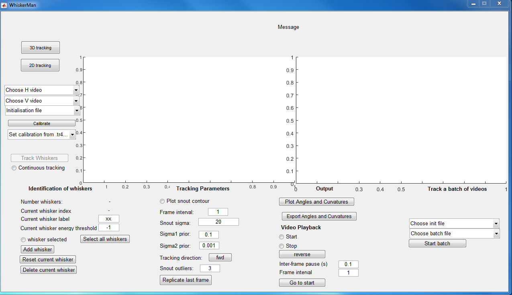
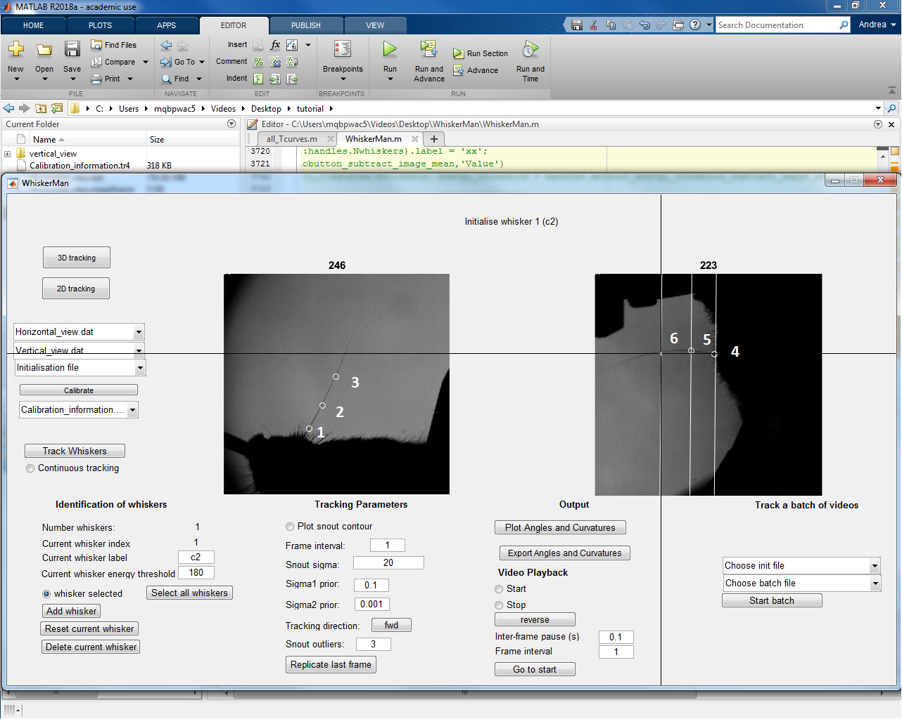
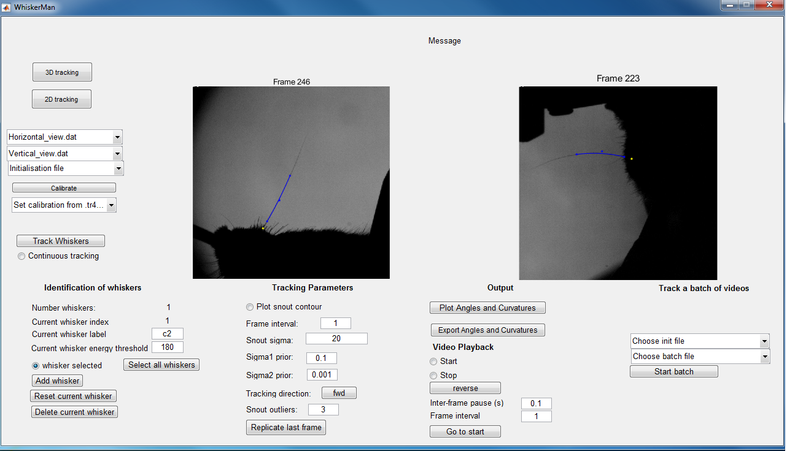

# Whi[s]kerMan Documentation

## Table of contents
- [Open Whiskerman](./Open_whiskerman.md#open-whiskerman)

- [2D Whisker Tracking](./Open_whiskerman.md#2d-whisker-tracking)
  
  - [Single whisker](./Open_whiskerman.md#tracking-one-whisker)
  
  - [Multiple whiskers](./Open_whiskerman.md#tracking-multiple-whiskers)
  
 - [3D Whisker Tracking](./Open_whiskerman.md#3d-whisker-tracking)
 
 - [3D Calibration](./Open_whiskerman.md#3d-calibration)
 
 - [Others](./Open_whiskerman.md#Others)
 
 - [Buttons and options in the GUI](./Open_whiskerman.md#buttons-and-options-in-the-gui)
 
 - [Keyboard commands](./Open_whiskerman.md#keyboard-commands)

## Open WhiskerMan 

1. Extract Whiskerman  to a folder (e.g. "C:\user\whiskerman ").

2. Within Matlab, add this folder to the current path (e.g addpath(‘C:\ user\whiskerman’)).

3. Make a  folder that contains the horizontal view videos (e.g. cd ‘C:\ExampleH’). If doing 3D tracking also, within this folder, create a sub-folder called “vertical_view” (the name must be exactly this) containing the vertical view videos.

4. Within Matlab, “cd” to the folder containing the horizontal view videos and enter ‘WhiskerMan’ on the command line.  A GUI resembling the following should appear.

## 2D Whisker Tracking

### Tracking one whisker:
---

1. In the Whiskerman gui … Select “2D tracking”

2. Select the video to be tracked using the “Choose H video” menu.

3. Select “Continuous tracking” (otherwise only the current frame is tracked)

4. Press “Track whiskers” to start the tracking of the first frame. 

5. Whiskerman will prompt you to initialise the control points of the whiskers highlighting the position of the cursor (see the paper for explanation). 
To define the control points, select, using mouse clicks, the first, second and third control point of the Bezier curve in the horizontal view (starting with that closest to the snout).
If parameters are set appropriately for your video, Whiskerman will track each frame until either the end of the video is reached or the algorithm’s quality control criteria fail in a given frame.

6. To halt tracking at any point, deselect “Continuous tracking”.

**Common problem:** 

If Whiskerman tracks the first frame but then stops, a common reason for this is that the parameter “current whisker energy threshold” is too low.  See the paper for explanation of how Whiskerman evaluates the quality of its tracking solutions (using a cost function) and see the hints below for something to try that often works.

### Tracking multiple whiskers:
---

1. In the whiskerman gui … Select “2D tracking”

2. Select the video to be tracked using the “Choose H video” menu.

3. Define the whiskers to be tracked in the “identification of the whiskers” section. To do this, write the name of the first whisker and define the energy threshold for the whisker. 

4. To add another whisker, press “add whisker” and complete the information of the following whisker.

5. Press “Track whiskers” to start the tracking of the first frame. Whiskerman will prompt the user to initialise the control points of the whiskers highlighting the position of the cursor. To define the control points, select, using mouse clicks, the first, second and third control point of the Bezier curve in the horizontal view (starting with that closest to the snout). If more than one whisker were defined, follow the same procedure for the next whiskers.
Whiskerman will show the tracking of the first frame and will move to the next frame. To track the current frame, press “Track whiskers”. Alternatively, select “Continuous tracking” and then press “Track whiskers”, in which case the tracking proceeds automatically from frame to frame until: a) “Continuous tracking” is deselected, b) the end of the video is reached or c) tracking fails for all selected whiskers.

**Hints:**

- If the tracker halts after tracking just one frame, it may be that the “current whisker energy threshold” parameter is too low.  
Whiskerman evaluates the quality of its solution for a given frame by computing an “energy” value (see the paper for detailed explanation).  

- If this energy is less than threshold, tracking stops.  The radio button “whisker selected” will be deselected.  
To restart tracking, increase the value of the threshold, (re)select “whisker selected”, and then click “Track whiskers”. 

## 3D Whisker Tracking

**Requirements:**

1. One or more pairs of videos, with each pair consisting of a horizontal view of the mouse and a vertical view

2. Calibration videos

### Instructions

1. Select “3D tracking”

2. Using the “Choose H video” menu, select the horizontal view video you wish to be track.

3. Using the “Choose V video” menu, select the corresponding vertical view video. The first frame of each video should appear in the display. 

3. Calibrate.  If videos with the current camera configuration have previously been tracked, calibration data will have been saved in the corresponding .tr4 file and can be loaded using the ‘Set calibration from .tr4’ menu.  Otherwise, use calibration videos, as detailed below.

4. In the “identification of the whiskers” section of the GUI, define the whiskers to be tracked. To do this, for the first whisker that you want to track, specify its “current whisker label” (C1, C2 etc) and, if desired, the energy threshold (see help). To track an additional whisker, press “add whisker” and complete the information of the following whisker.  Repeat for as many whiskers as desired.

5. To initiate tracking, press the “Track whiskers”  button.  Note that this button is disabled until calibration information is specified. 

6. If this is the first frame of an untracked video, a cross-hair will appear, prompting you to initialise NBezier control points for the selected whiskers. Start by defining control points for the first whisker in the horizontal view (See figure below).  Use the mouse to position the cross-hairs at each control point in turn (starting with that closest to the snout) and select using mouse clicks. Next, a guide line will appear in the vertical view that specifies the locus of points in this view consistent with the point selected in the horizontal view.  Define control points in the vertical view by using the mouse to move the cross-hairs to the desired location along the guide line and left-click.  Repeat for the other two control points.  If more than one whisker was defined, follow the same procedure for each in turn.  WhiskerMan will then use the specified points as initial conditions to fit Bezier curves to the whiskers in the current frame.  If the fitting is successful, WhiskerMan will then advance to the next frame. 

7. To check the solution, use the left arrow on the keyboard to step back to the previous frame.  The tracking solutions are shown as coloured curves and the control points as dots (See figure Below).  If tracking has succeeded, these curves will match the shape of the target whiskers.  If not, try re-initialising or vary tracking parameters (see help).

8. Step to the first untracked frame and, press “Track Whiskers”.  Alternatively, first select “Continuous tracking” in which case the tracking proceeds automatically until : a) “Continuous tracking” is deselected, b) the end of the video is reached or c) tracking fails for all selected whiskers.

## 3D Calibration
 
## Others

## Buttons and options in the GUI
 
 
## Keyboard commands 

### Navigation though the video

1. Right arrow= advance 1 frame forward
2. Shift+ Right arrow= advance 10 frames forward
3. Ctrl+ Right arrow= advance 100 frames forward
4. Left arrow= advance 1 frame backward
5. Shift+ Left arrow= advance 10 frames forward
6. Ctrl+ Left arrow= advance 100 frames backward

### Manual editing of Bezier control points
 
1.	w= change current whisker. This will display the number of the current frame, the energy value and the length of the Bezier curve for the current whisker at the top of the GUI.
2.	Down arrow= start manual editing mode for current whisker (selected with w)
3.	Up arrow= start manual editing mode for current whisker (selected with w)

Once in the manual editing mode:

4.	Down arrow= Change the currently selected control point
5.	Up arrow= Change the currently selected control point

Once the control point is selected:

6.	Alt+ left arrow= move the selected control point in the negative x direction (x axis of the horizontal view)
7.	Alt+ right arrow= move the selected control point in the positive x direction
8.	Alt+ up arrow= move the selected control point in the positive y direction (y axis of the horizontal view)
9.	Alt+ down arrow= move the selected control point in the negative y direction
10.	Alt+ Page Up= move the selected control point in the positive z direction (y axis of the vertical view).
11.	Alt+ Page Down= move the selected control point in the negative z direction
